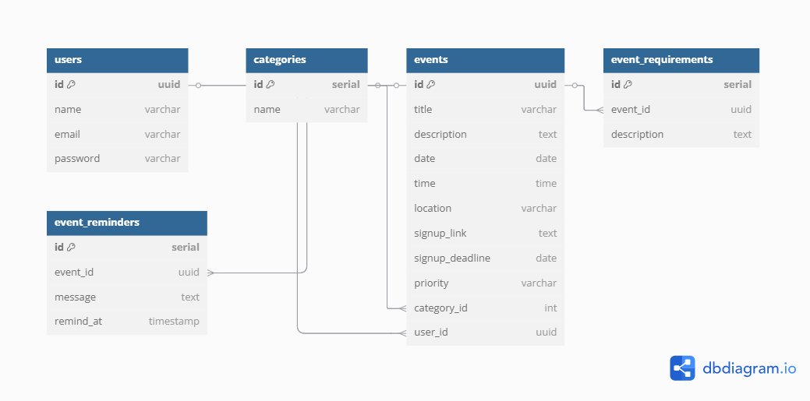
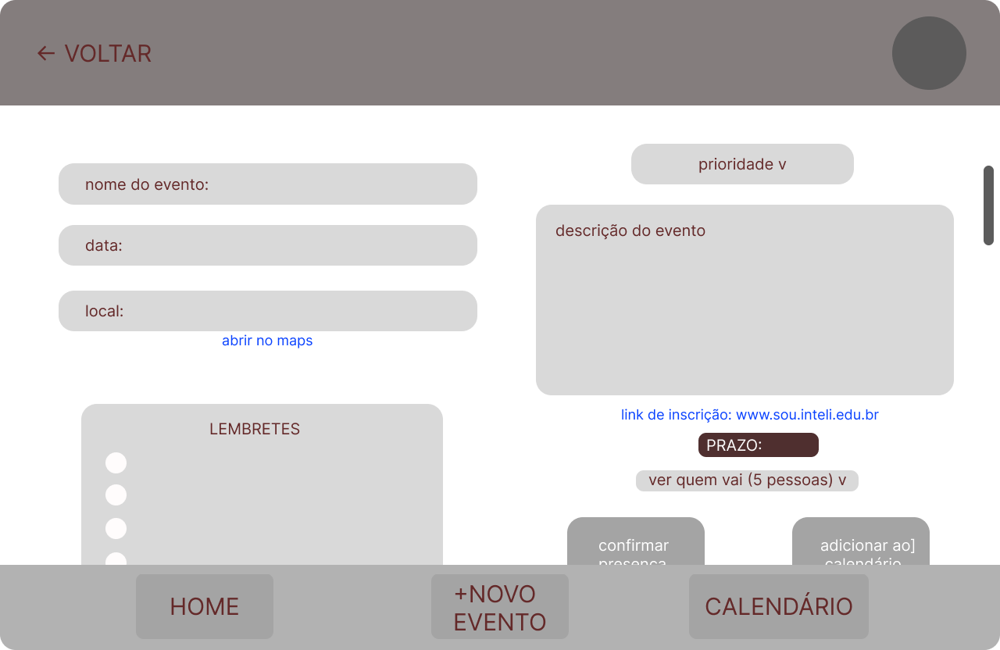
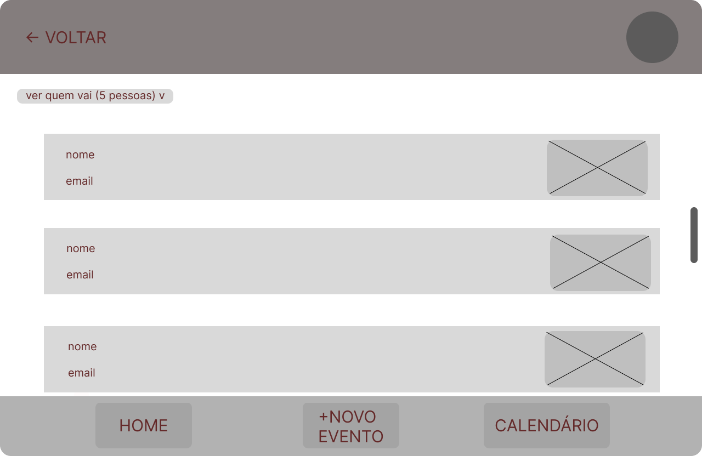
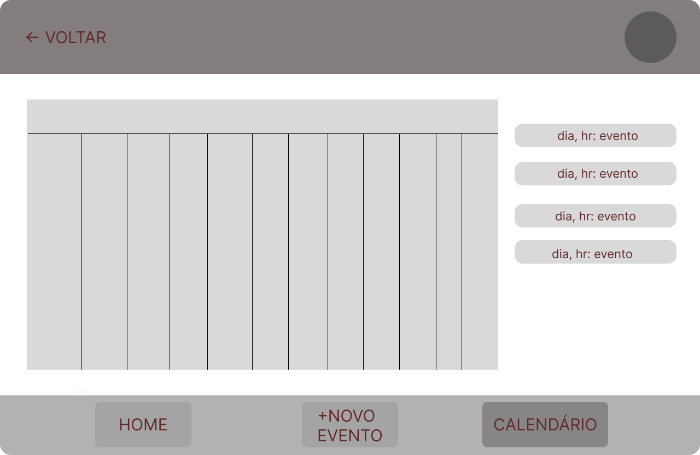
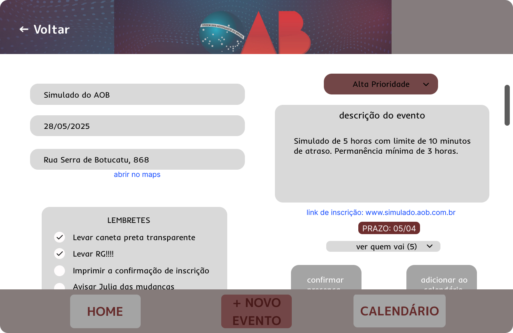
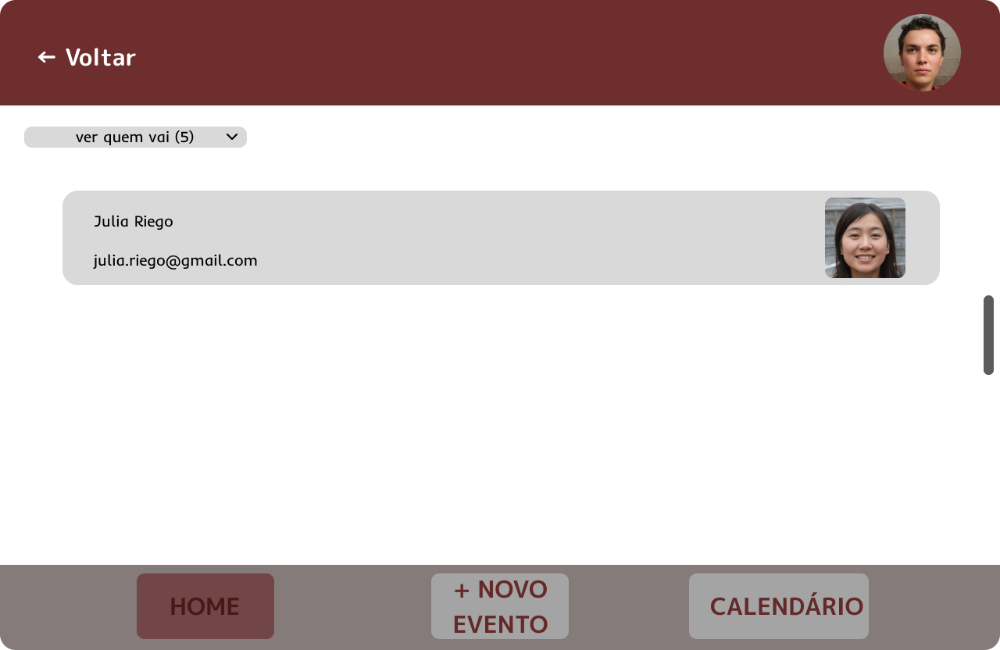
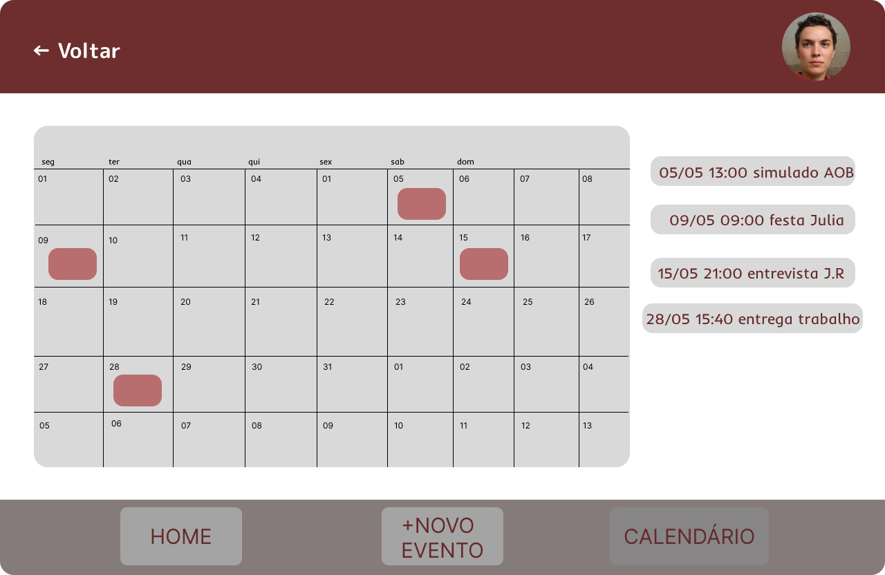

# Web Application Document - Projeto Individual - Módulo 2 - Inteli

## 1. Introdução (Semana 01)

Organizar eventos e compromissos é uma parte essencial da vida acadêmica, profissional e pessoal. No entanto, em meio a tantos prazos, inscrições e deslocamentos, é comum se perder em detalhes importantes: esquecer documentos, perder o prazo de uma inscrição ou chegar atrasado por não ter previsto o trânsito.
Pensando em resolver essas dores reais e cotidianas, este projeto propõe o desenvolvimento de uma plataforma inteligente, segura e totalmente individual para o gerenciamento de eventos e compromissos. A solução vai além da simples inscrição: ela permite centralizar prazos importantes, salvar links de inscrições externas, organizar lembretes personalizados sobre o que fazer ou levar antes de cada evento e facilitar o deslocamento através da integração com aplicativos de GPS.
Como forma de garantir a privacidade da usuária, o acesso à plataforma é protegido por senha, garantindo que apenas ela possa visualizar e editar seus compromissos. Com uma interface intuitiva, categorização de eventos por temas e prioridade, e gestão centralizada de informações relevantes, o sistema visa não apenas lembrar a usuária de seus compromissos, mas transformar toda a experiência de participação em eventos em algo mais organizado, prático e sem estresse.

---

## 2. Visão Geral da Aplicação Web

### 2.1. Personas (Semana 01)
Anna Peixoto tem 21 anos, é estudante universitária e estagiária de marketing. No seu dia a dia, utiliza constantemente aplicativos de calendário, redes sociais e ferramentas de organização para tentar manter sua rotina sob controle. Participa ativamente de eventos acadêmicos, cursos online e também está sempre envolvida em processos seletivos em busca de oportunidades de carreira.
Apesar do esforço para se manter organizada, Anna sente dificuldade em lidar com a quantidade de informações espalhadas em diferentes plataformas. Já perdeu prazos de inscrição para vestibulares e cursos importantes, esqueceu documentos essenciais em eventos e, por vezes, sentiu-se perdida tentando acompanhar todos os preparativos necessários.
Para resolver esses problemas, ela precisa de uma ferramenta que centralize inscrições de eventos, prazos importantes, documentos a serem levados e lembretes personalizados, com integração simples ao seu calendário e e-mail. Uma plataforma que, além de organizar suas tarefas e compromissos, também facilite o deslocamento para eventos e ajude a reduzir o estresse de perder prazos e informações importantes.

### 2.2. User Stories (Semana 01)

USER STORY 01 | Como usuária, quero visualizar eventos organizados por categorias e níveis de prioridade, para encontrar de forma rápida os que mais combinam com meu interesse e com a minha disponibilidade.
USER STORY 02 | Como usuária, quero receber lembretes personalizados sobre tarefas ou documentos que preciso preparar antes de um evento, para garantir que esteja completamente pronta e evitar esquecimentos.
USER STORY 03 | Como usuária, quero integrar os eventos confirmados diretamente ao meu calendário pessoal e e-mail, para não correr o risco de esquecer compromissos importantes.
USER STORY 04 | Como usuária, quero acessar facilmente o endereço do evento e receber alertas sobre o trânsito até o local, para conseguir me planejar melhor e chegar no horário.
USER STORY 05 | Como usuária, quero adicionar links de inscrições e associar prazos importantes dentro da plataforma, para não perder oportunidades de cursos, vestibulares ou eventos que sejam relevantes para o meu crescimento acadêmico e profissional.

User Story analisada: Como usuária, quero adicionar links de inscrições e associar prazos importantes dentro da plataforma, para não perder oportunidades de cursos, vestibulares ou eventos que sejam relevantes para o meu crescimento acadêmico e profissional.

Independente- A funcionalidade de adicionar links é independente das demais funções da plataforma, como confirmação de presença em eventos ou criação de lembretes. O usuário pode adicionar links e prazos a qualquer momento, sem depender de outros fluxos.

Negociável- A maneira como os links e prazos são inseridos pode ser adaptada conforme o desenvolvimento da aplicação, permitindo, por exemplo, a adição de categorias para organizar melhor as inscrições ou até integrações automáticas futuras.

Valiosa- Essa funcionalidade reduz drasticamente o risco de perda de prazos importantes para inscrições em vestibulares, cursos e eventos. Organizar essas informações em um único lugar gera valor real para a vida acadêmica e profissional do usuário.

Estimável- É possível estimar de forma clara o esforço para implementação: envolveria o desenvolvimento de campos para registro de links, prazos e alertas associados, além da integração desses lembretes ao calendário e notificações.

Small (Pequena)- Inserir e gerenciar links de inscrições é uma funcionalidade específica, de escopo reduzido, que pode ser desenvolvida de forma rápida e iterativa, sem grandes riscos de complexidade técnica.

Testável- A funcionalidade pode ser facilmente testada criando links e prazos fictícios, verificando se os lembretes são gerados corretamente e se os usuários conseguem acessar os sites informados dentro dos prazos estipulados.

---

## 3. Projeto da Aplicação Web

### 3.1. Modelagem do banco de dados  (Semana 3)

A seguir está o diagrama relacional representando a estrutura de dados utilizada para organizar eventos, lembretes, categorias e usuários. Ele foi construído com base nas necessidades funcionais descritas nas User Stories e garante a integridade dos dados.

As principais tabelas são:

users: Usuário individual da aplicação (único login).

categories: Classificações atribuídas a eventos (ex.: "Vestibular", "Curso").

events: Estrutura principal que armazena título, data, link de inscrição, local e categoria.

event_requirements: Lista de requisitos para o evento (ex.: "Levar RG").

event_reminders: Lembretes associados ao evento, com horário de notificação.

### 3.1.1 BD e Models (Semana 5)

O sistema possui os seguintes Models implementados:

UserModel: responsável por criação, leitura e atualização de dados de usuários.
EventModel: gerencia os eventos cadastrados e seus atributos (data, local, prioridade...).
CategoryModel: permite listar categorias para organizar eventos.
EventRequirementModel: permite adicionar e consultar itens necessários para cada evento.
EventReminderModel: define lembretes com data e hora específica.

### 3.2. Arquitetura (Semana 5)

O sistema foi construído com base na arquitetura MVC (Model-View-Controller), garantindo separação clara entre regras de negócio, controle de fluxo e estrutura de dados.

Model- Camada responsável pela comunicação com o banco de dados. Cada entidade (usuário, evento, categoria, requisito, lembrete) possui um Model próprio que encapsula as operações SQL (SELECT, INSERT, UPDATE, DELETE).

Controller- Camada intermediária que recebe requisições HTTP, chama os métodos do Model, aplica regras de negócio e retorna as respostas apropriadas (JSON). Está localizada na pasta /controllers.

View- Neste projeto, a camada View é representada por respostas em JSON consumidas via ferramentas como Thunder Client ou frontend externo (não implementado aqui).

 *Fluxo da Arquitetura MVC*

Usuário → (requisição HTTP) → Controller → Model → Banco de Dados
     ← (resposta JSON) ←

*Organização de pastas*

/models       # Interação com o banco
/controllers  # Lógica de aplicação
/routes       # Endpoints da API
/config       # Conexão com PostgreSQL
/server.js    # Inicialização da aplicação

**Instruções para criação do diagrama de arquitetura**  
- **Model**: A camada que lida com a lógica de negócios e interage com o banco de dados.
- **View**: A camada responsável pela interface de usuário.
- **Controller**: A camada que recebe as requisições, processa as ações e atualiza o modelo e a visualização.
  
[diagrama](../assets/diagramPIevents.png)

### 3.3. Wireframes (Semana 03)
## 3.3 Wireframes

Os wireframes abaixo representam as principais telas da aplicação web desenvolvida neste projeto, cobrindo de forma visual as funcionalidades descritas nas User Stories. O foco está na organização da interface, fluxo de navegação e apresentação clara das ações do usuário.

### Tela 1 – Dashboard (Tela Principal)
A primeira tela apresenta a listagem de eventos, com filtros por categoria e prioridade. Permite acesso direto ao calendário e à criação de novos eventos.
- **User Story atendida:** US01

### Tela 2 – Calendário Pessoal
Visual mensal dos compromissos marcados pelo usuário, com destaque por prioridade. Facilita o planejamento e a integração com o calendário pessoal.
- **User Stories atendidas:** US01, US03

### Tela 3 – Detalhes do Evento
Exibe informações completas do evento: nome, data, local, link de inscrição e lembretes personalizados. Possui botões para confirmar presença e adicionar ao calendário.
- **User Stories atendidas:** US02, US03, US04, US05, US06

### Tela 4 – Quem Vai
Mostra a lista de participantes confirmados, com opção de ocultar presença. Facilita a socialização e evita desconfortos sociais.
- **User Story atendida:** US04

As imagens dos wireframes estão a seguir:

### Tela 1 – Dashboard

### Tela 2 – Calendário Pessoal

### Tela 3 – Detalhes do Evento

### Tela 4 – Quem Vai

### 3.4. Guia de estilos (Semana 05)

*Descreva aqui orientações gerais para o leitor sobre assets/wireframetela4como utilizar os componentes do guia de estilos de sua solução.*

### 3.5. Protótipo de alta fidelidade (Semana 05)

Abaixo, estão representadas as telas principais do sistema em alta fidelidade, seguindo as funcionalidades definidas nas User Stories e wireframes anteriores:

### Tela 1 – Dashboard

### Tela 2 – Calendário Pessoal

### Tela 3 – Detalhes do Evento

### Tela 4 – Quem Vai

### 3.6. WebAPI e endpoints (Semana 05)

Abaixo estão listados os principais endpoints da API REST desenvolvida neste projeto. Todos aceitam e retornam dados em formato JSON.

Usuários (/users)
 
| Método | Endpoint      | Descrição                         |
|--------|---------------|-----------------------------------|
| GET    | /users        | Lista todos os usuários           |
| GET    | /users/:id    | Busca usuário pelo ID             |
| POST   | /users        | Cria um novo usuário              |
| PUT    | /users/:id    | Atualiza dados de um usuário      |

Eventos (/events)

| Método | Endpoint      | Descrição                         |
|--------|---------------|-----------------------------------|
| GET    | /events       | Lista todos os eventos            |
| GET    | /events/:id   | Busca evento por ID               |
| POST   | /events       | Cria um novo evento               |
| PUT    | /events/:id   | Atualiza dados de um evento       |

Categorias (/categories)

| Método | Endpoint      | Descrição                         |
|--------|---------------|-----------------------------------|
| GET    | /categories   | Lista todas as categorias         |

Requisitos de Evento (/requirements)

| Método | Endpoint                     | Descrição                              |
|--------|------------------------------|----------------------------------------|
| GET    | /events/:id/requirements     | Lista requisitos de um evento          |
| POST   | /requirements                | Cria um novo requisito para um evento  |
| DELETE | /requirements/:id            | Deleta um requisito                    |

Lembretes (/reminders)

| Método | Endpoint                   | Descrição                             |
|--------|----------------------------|---------------------------------------|
| GET    | /events/:id/reminders      | Lista lembretes de um evento          |
| POST   | /reminders                 | Cria um novo lembrete                 |
| DELETE | /reminders/:id             | Deleta um lembrete 

### 3.7 Interface e Navegação (Semana 07)

*Descreva e ilustre aqui o desenvolvimento do frontend do sistema web, explicando brevemente o que foi entregue em termos de código e sistema. Utilize prints de tela para ilustrar.*

---

## 4. Desenvolvimento da Aplicação Web (Semana 8)

### 4.1 Demonstração do Sistema Web (Semana 8)

*VIDEO: Insira o link do vídeo demonstrativo nesta seção*
*Descreva e ilustre aqui o desenvolvimento do sistema web completo, explicando brevemente o que foi entregue em termos de código e sistema. Utilize prints de tela para ilustrar.*

### 4.2 Conclusões e Trabalhos Futuros (Semana 8)

*Indique pontos fortes e pontos a melhorar de maneira geral.*
*Relacione também quaisquer outras ideias que você tenha para melhorias futuras.*

## 5. Referências

_Incluir as principais referências de seu projeto, para que seu parceiro possa consultar caso ele se interessar em aprofundar. Um exemplo de referência de livro e de site:_ 

---
---
